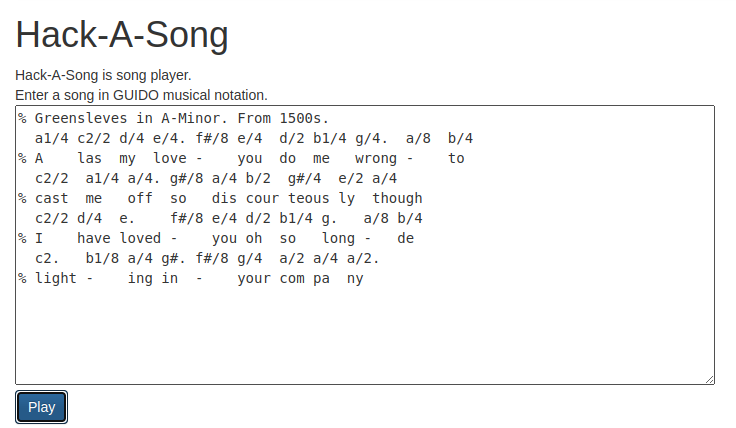

Hack-A-Day is a project I'm doing in November, where I try to make 30 new projects, in 30 days.

# Day 16: Hack-A-Sound

This is a song player.

Demo available [here](https://tilde.za3k.com/hackaday/song).

Source available on [github](https://github.com/za3k/day16_song).

# Credits

- Piano notes from [SingleInfinity](https://www.reddit.com/r/piano/comments/3u6ke7/heres_some_midi_and_mp3_files_for_individual/) on reddit.
- Sample music is "Greensleeves", from the 1500s, in A-minor. The specific sheet music is from [true-piano-lessons.com](https://www.true-piano-lessons.com/support-files/greenlseevescomplete.pdf).
- Notation used is a simplified version of [Guido d'Arezzo music notation](https://wiki.ccarh.org/wiki/Guido_Music_Notation). The simplified notation supports only note, octave, sharp, duration, and chords: `{b0#/8,e}`
